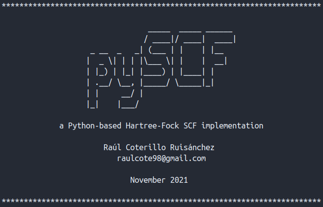

# pySCF

A basic, single-file Python-based implementation of the closed-shell Hartree Fock SCF algorithm, supporting s-type orbitals only. Example input files are provided, alongside some basis sets and their respective references.

- Single-point energy calculations with orbital population analysis (Mulliken, Löwdin)
- Calculates, reads and writes one and two-electron matrix elements.
- Supports [Gaussian](https://gaussian.com/) (.gbs) basis sets from [BSE](https://www.basissetexchange.org/)

## Usage
In order to use the script, just open a terminal (Linux) in the repo folder and run:
```bash
pySCF.py [options] [input_file] > [output_file]
```

#
<p align="center">
  
</p>

 